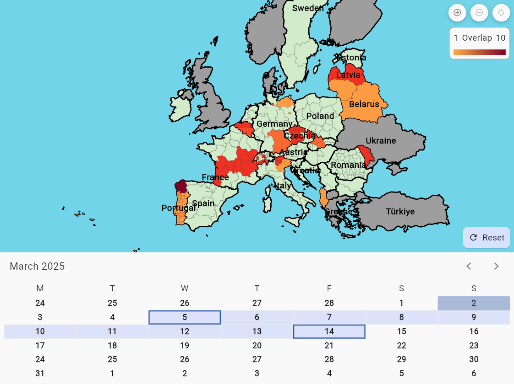

Visualization of Holidays in Europe

# Motivation

Ever wanted to know **when a certain country** or region has school or public **holidays**?
And then having to **scour the internet** for those dates only to find out, that they **heavily vary** by region?

I sure **felt that pain** and thus went on to try and solve that.

# Description

This simple webapp visualizes **school and public holidays** of most european countries, **including their subregions**.
You simply choose a **range of dates** and a **heat map** will show the amount of holidays, that overlap with your choice.

> That way, you can immediately see where it could be busy and enjoy your trips in solitude. 😌

Furthermore, **selecting a region** will show you the **details** which holidays are present during that time and how many **days of overlap** you will face.

# Data Sources

All data are pulled from the excellent, open-source project [OpenHolidays API](https://www.openholidaysapi.org/en/).
Without their efforts, none of this would be possible! So go ahead and leave them a star ⭐ at their [Github repo](https://github.com/openpotato/openholidaysapi.website).

> I take no liabilty in the correctness of the data!

# Technical Details

- The Webapp is written in Flutter and compiled to **WebAssembly** using [Flutter for Web](https://flutter.dev/multi-platform/web).
- All data is shipped along the Webapp, therefore **no internet connection** is required during use.
- The Webapp can be installed as a **Progressive Web App** (PWA) when using a Chromium based browser (Chromium/Chrome/Edge etc.).
- Data are pulled and repackaged on a bi-monthly basis (via a Python script).
